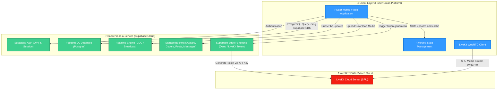
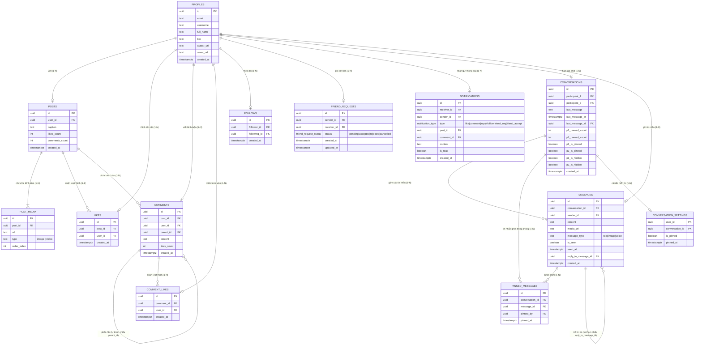
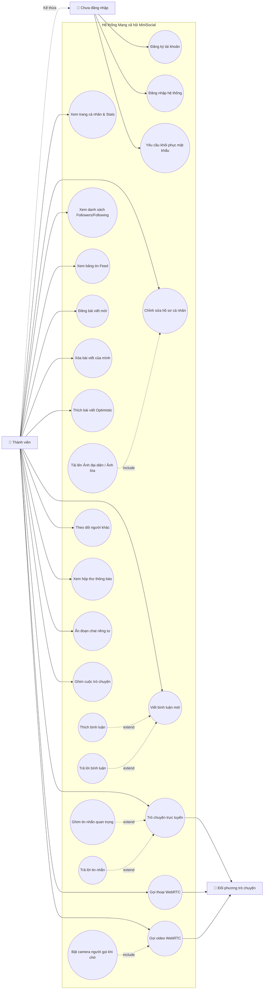

# 🏛️ Kiến trúc Dự án & Đặc tả Use Cases — MiniSocial

Tài liệu này cung cấp cái nhìn toàn diện về kiến trúc hệ thống, kiến trúc mã nguồn Flutter, thiết kế cơ sở dữ liệu (ERD) và các trường hợp sử dụng (Use Cases) của hệ thống **MiniSocial** — ứng dụng mạng xã hội đa nền tảng hiện đại tích hợp gọi điện WebRTC và nhắn tin thời gian thực.

---

## 🗺️ 1. Tổng quan Kiến trúc Hệ thống (System Architecture)

MiniSocial được thiết kế theo mô hình **Client-Server lai** kết hợp các dịch vụ điện toán đám mây thế hệ mới (Backend-as-a-Service - BaaS) để tối ưu hiệu năng và thời gian triển khai:



### Chi tiết các tầng thành phần:

1. **Client Layer (Flutter)**:
   - Viết bằng Dart, chạy mượt mà trên iOS, Android và trình duyệt Web.
   - **Riverpod**: Đóng vai trò quản lý trạng thái, đồng bộ hoá dữ liệu đệm (caching), tự động cập nhật trạng thái Optimistic UI (phản hồi tức thì trước khi ghi nhận xuống DB).
   - **LiveKit Client SDK**: Tương tác trực tiếp với phần cứng Camera/Microphone, render luồng video thời gian thực (`VideoTrackRenderer`) và thiết lập các kết nối ngang hàng (Peer Connection) qua giao thức WebRTC.

2. **Backend Layer (Supabase Cloud)**:
   - **Auth**: Quản lý phiên đăng nhập bảo mật, tự động kích hoạt trigger PostgreSQL để tạo mới bản ghi `profiles` ngay khi người dùng đăng ký tài khoản thành công.
   - **PostgreSQL Database**: CSDL quan hệ lưu trữ dữ liệu có cấu trúc ổn định, sử dụng triệt để cơ chế Trigger và Function nội trú (Stored Procedures) để tự động hóa nghiệp vụ (ví dụ: tự tăng số like/comment, tự sinh thông báo).
   - **Realtime Engine**: Lắng nghe thay đổi dữ liệu Postgres (CDC) hoặc phát tin nhắn quảng bá (Broadcast) để đồng bộ hóa tin nhắn chat và cuộc gọi đến.
   - **Storage Buckets**: Lưu trữ file tĩnh được chia thành các thư mục bảo mật (`avatars/`, `covers/`, `posts/`, `messages/`).
   - **Edge Functions**: Các đoạn mã Javascript/Typescript chạy không máy chủ (Serverless Deno) phục vụ các tác vụ nâng cao bảo mật như sinh mã truy cập LiveKit Token.

3. **Media Cloud (LiveKit SFU)**:
   - Kiến trúc SFU (Selective Forwarding Unit) chịu trách nhiệm định tuyến, chuyển tiếp luồng hình ảnh/âm thanh chất lượng cao giữa các Client mà không làm nặng thiết bị người dùng.

---

## 🏗️ 2. Kiến trúc Mã nguồn Frontend (Frontend Code Architecture)

Dự án MiniSocial áp dụng kiến trúc **Feature-First** (Tổ chức theo tính năng) kết hợp cấu trúc phân tầng **Layered Architecture (Clean-ish Architecture)** giúp tăng khả năng tái sử dụng, cô lập mã lỗi và phát triển song song:

```
lib/
├── main.dart                      # Điểm khởi chạy ứng dụng (Entry Point)
├── app.dart                       # Cấu hình MaterialApp, Routing và Dark Theme
│
├── core/                          # Tầng lõi dùng chung của toàn hệ thống
│   ├── constants/                 # Màu sắc, font chữ, các hằng số DB
│   ├── theme/                     # Cấu hình Light/Dark Theme phong cách iOS
│   ├── router/                    # Bộ định tuyến GoRouter (Stateful Shell Route)
│   └── extensions/                # Các Helper định dạng thời gian (timeago), chuỗi
│
├── shared/                        # Widgets và Providers tái sử dụng chéo
│   ├── widgets/                   # AppAvatar, AppButton, AppTextField, Loading
│   └── providers/                 # supabaseServiceProvider
│
└── features/                      # Chứa các mô-đun tính năng cô lập
    ├── auth/                      # Quản lý đăng ký, đăng nhập, quên mật khẩu
    ├── profile/                   # Trang cá nhân, danh sách theo dõi, sửa thông tin
    ├── feed/                      # Bảng tin bài viết, đăng bài, Thích & Bình luận
    ├── search/                    # Tìm kiếm tài khoản thông minh (Debounced 400ms)
    ├── social/                    # Theo dõi (Follow) và Thông báo (Notification)
    ├── chat/                      # Chat realtime, Ghim, Ẩn đoạn chat, Trả lời, Ghim tin
    └── call/                      # Gọi thoại & Video call thời gian thực (LiveKit WebRTC)
```

### Kiến trúc các phân lớp trong từng Feature:
Mỗi mô-đun trong `features/` được chia làm 3 lớp riêng biệt:

```
feature_name/
├── data/          # [Data Layer] - Giao tiếp với Supabase Client API, lấy dữ liệu thô
│   └── x_repository.dart
├── domain/        # [Domain Layer] - Định nghĩa các thực thể và mô hình dữ liệu (Model)
│   └── x_model.dart
├── providers/     # [Logic Layer] - Riverpod providers điều khiển trạng thái nghiệp vụ
│   └── x_provider.dart
└── presentation/  # [UI Layer] - Widget giao diện hiển thị và nhận cử chỉ người dùng
    ├── screens/
    └── widgets/
```

- **Lớp Giao diện (UI Layer)**: Chỉ hiển thị dữ liệu nhận được từ lớp logic và gửi tín hiệu hành động. Hoàn toàn không chứa logic nghiệp vụ hay truy vấn trực tiếp CSDL.
- **Lớp Trạng thái (Logic/Provider Layer)**: Nhận yêu cầu từ giao diện, gọi lớp dữ liệu, xử lý tính toán, lưu trữ trạng thái hiện tại và cập nhật lại giao diện.
- **Lớp Dữ liệu (Data Layer)**: Đóng vai trò là cầu nối với các API bên ngoài, chuyển đổi dữ liệu thô (JSON) thành các đối tượng Dart mạnh mẽ (Model).

---

## 🗄️ 3. Sơ đồ Thực thể Cơ sở Dữ liệu (Entity Relationship Diagram - ERD)

Dưới đây là thiết kế cơ sở dữ liệu quan hệ tối ưu hóa cao chạy trên PostgreSQL qua Supabase, biểu diễn mối quan hệ giữa các thực thể chính:



---

## 👥 4. Tác nhân Hệ thống (System Actors & Users)

Hệ thống xác định rõ 3 nhóm tác nhân chính tham gia tương tác:

1. **Người dùng chưa đăng nhập (Unauthenticated User)**:
   - Người dùng mới tải ứng dụng (chưa có tài khoản) hoặc thành viên đã có tài khoản nhưng hiện đang ở trạng thái đăng xuất.
   - Chỉ có quyền truy cập các tính năng thuộc mô-đun **Auth** (Xem trang đăng nhập, đăng ký, khôi phục mật khẩu). Hoàn toàn bị chặn khỏi dữ liệu xã hội nhờ cơ chế **Auth Guard** trên bộ định tuyến GoRouter.

2. **Thành viên đã xác thực (Authenticated User)**:
   - Người dùng đã vượt qua bước xác thực, có khóa JWT bảo mật.
   - Có toàn quyền tương tác mạng xã hội: đăng bài, bình luận, thích, kết nối theo dõi, nhắn tin trực tuyến và thực hiện cuộc gọi.
   - Hệ thống tự phân tách vai trò động trên dữ liệu cá nhân (ví dụ: chỉ được xóa bài viết của mình, tự do đổi bio của mình nhờ các điều khoản bảo mật **Row Level Security - RLS** trong Postgres).

3. **Đối phương Tương tác (Call / Chat Peer)**:
   - Một tác nhân xác định đối thoại với Authenticated User trong các luồng gọi điện thời gian thực (Caller / Callee) hoặc trò chuyện hai bên.

---

## 🎯 5. Biểu đồ Các Trường hợp Sử dụng (Use Cases Diagram)

Dưới đây là sơ đồ Use Cases biểu diễn đầy đủ tất cả các tính năng nghiệp vụ của một Thành viên mạng xã hội MiniSocial:



---

## 📊 6. Đặc tả Chi tiết các Use Cases chính theo Mô-đun

| ID | Nhóm tính năng | Tên Use Case | Tác nhân chính | Mô tả luồng hoạt động chính |
| :--- | :--- | :--- | :--- | :--- |
| **UC-01** | **Authentication** | Đăng ký tài khoản | Người dùng chưa đăng nhập | Người dùng nhập Email, Mật khẩu, Tên đầy đủ → Supabase khởi tạo tài khoản → Kích hoạt Trigger tự động tạo bản ghi `profiles` → Gửi mail xác nhận kích hoạt. |
| **UC-02** | **Authentication** | Đăng nhập hệ thống | Người dùng chưa đăng nhập | Người dùng nhập Email + Mật khẩu hợp lệ → Hệ thống cấp token JWT → Lưu phiên làm việc thông qua SecureStorage → Chuyển hướng vào trang chính `/feed`. |
| **UC-03** | **Profile** | Xem & Cập nhật thông tin | Thành viên | Người dùng xem thông tin số lượng follow cá nhân, đổi tên, viết bio. Cho phép chọn ảnh mới tải lên storage bucket `avatars` / `covers` và cập nhật tức thời giao diện. |
| **UC-04** | **Profile** | Xem danh sách kết nối | Thành viên | Người dùng nhấp chọn số lượng Người theo dõi hoặc Đang theo dõi → Mở màn hình danh sách 2 tab phong cách iOS → Thực hiện theo dõi/bỏ theo dõi tức thời bằng nút hành động nhanh. |
| **UC-05** | **Feed & Posts** | Tải bảng tin & Đăng bài | Thành viên | Người dùng tải bảng tin gồm bài viết của bản thân và những người đang follow. Để đăng bài mới, chọn tối đa 5 ảnh hoặc video từ thư viện, ghi caption, hệ thống tự nén trước khi đưa lên storage. |
| **UC-06** | **Social** | Tương tác & Thông báo | Thành viên | Bấm thích bài viết hoặc bình luận sử dụng cơ chế **Optimistic UI** hiển thị kết quả ngay tức khắc. Mọi lượt like/comment/follow đều kích hoạt trigger sinh thông báo đẩy realtime qua Supabase Broadcast. |
| **UC-07** | **Realtime Chat** | Trò chuyện nâng cao | Thành viên, Peer | Hai người dùng trao đổi tin nhắn văn bản, hình ảnh có chú thích, hoặc tin nhắn thoại trực tiếp. Tin nhắn gửi đi hiển thị trạng thái "Đã gửi" và chuyển sang "✓✓ Đã xem" kèm thời gian chi tiết ngay khi đối phương xem tin. |
| **UC-08** | **Realtime Chat** | Quản lý hội thoại ẩn | Thành viên | Vuốt sang trái cuộc trò chuyện để **Ẩn** hoặc **Xóa vĩnh viễn**. Để truy cập danh mục "Đoạn chat bị ẩn", người dùng bắt buộc nhập đúng mã bảo mật 6 số (Passcode lock) do mình thiết lập. |
| **UC-09** | **Realtime Chat** | Ghim và Phản hồi tin | Thành viên | Người dùng ghim các tin quan trọng lên thanh ghim đầu phòng chat hoặc bấm trả lời trích dẫn tin nhắn. Khi bấm vào tin ghim hoặc tin trích dẫn, hệ thống tự động tải phân đoạn tin nhắn cũ xung quanh và cuộn mượt đến đúng vị trí tin gốc. |
| **UC-10** | **Calling WebRTC** | Gọi thoại & Gọi video | Thành viên, Peer | Người dùng nhấn nút gọi → Đổ chuông và phát âm rung cho cả 2 máy thông qua Supabase Realtime Channel. Với cuộc gọi video, camera máy người gọi tự động kích hoạt và hiển thị preview trực tiếp toàn màn hình ngay khi chuông đang đổ để chuẩn bị. Sau khi kết thúc, thời lượng cuộc gọi tự động ghi nhận vào CSDL. |

---

## 🔒 7. Bảo mật và Tối ưu hóa Hệ thống

1. **Row Level Security (RLS) trên Supabase**:
   - Mỗi bảng trong PostgreSQL đều áp dụng chính sách RLS cực kỳ chặt chẽ:
     - `profiles`: Người dùng chỉ được sửa thông tin cá nhân của chính mình (`auth.uid() = id`).
     - `messages`: Chỉ những người là thành viên của cuộc trò chuyện (`participant_1` hoặc `participant_2` trong bảng `conversations`) mới có quyền đọc hoặc ghi tin nhắn trong phòng đó.
     - `likes`, `comments`: Chỉ người dùng hiện tại được tạo lượt thích và viết bình luận dưới danh nghĩa của mình.

2. **Tối ưu hóa Truy vấn CSDL (Batch-Fetching)**:
   - Loại bỏ hoàn toàn lỗi truy vấn N+1 mạng bằng cách sử dụng gộp dữ liệu. Ví dụ: khi nạp bảng tin, trạng thái "đã thích" của toàn bộ bài viết hoặc toàn bộ bình luận đều được truy vấn đồng loạt chỉ trong **một câu lệnh SQL duy nhất** sử dụng bộ lọc `.inFilter()` của Supabase, đẩy nhanh thời gian phản hồi giao diện.

3. **Cải tiến Trải nghiệm Optimistic UI**:
   - Các hành động Thích bài viết, Thích bình luận, Theo dõi hoặc Thay đổi trạng thái cuộc gọi đều thay đổi giao diện ngay lập tức trước khi nhận phản hồi từ Server, triệt tiêu cảm giác trễ mạng cho người dùng.
