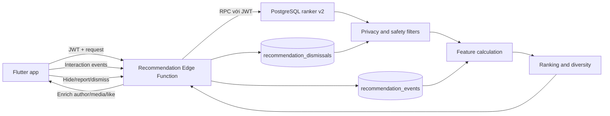

# Recommendation v2 — Kiến trúc, vận hành và kế hoạch phát triển

## 1. Mục tiêu

Recommendation v2 tạo một feed hữu ích, mới, đa dạng và an toàn cho từng người dùng. Hệ thống ưu tiên tính đúng đắn và khả năng giải thích trước khi dùng machine learning phức tạp.

Ba nguyên tắc bắt buộc:

1. Client không được quyết định danh tính, quyền xem hoặc thứ tự feed.
2. Mỗi đề xuất phải có nguồn và lý do để có thể đo lường, debug và cải tiến.
3. Tín hiệu tiêu cực như ẩn, báo cáo và không quan tâm phải có hiệu lực bền vững.

## 2. Kiến trúc tổng thể



### Thành phần

- `recommendation_events`: lưu sự kiện có `event_id` chống ghi trùng, thời lượng, vị trí và nguồn đề xuất.
- `recommendation_dismissals`: lưu bài, tác giả hoặc profile người dùng không muốn thấy.
- `get_recommended_feed_v2`: lọc quyền xem, tính feature, score và cursor.
- `get_people_you_may_know_v2`: gợi ý người dựa trên bạn chung và sở thích chung.
- `recommendation-engine`: xác thực JWT, validate request, gọi RPC và trả dữ liệu hoàn chỉnh.
- Flutter repository: giải mã kết quả nhưng không tự sắp xếp lại.

## 3. Luồng bảo mật

1. Flutter gửi access token hiện tại qua header `Authorization`.
2. Edge Function xác minh token bằng Supabase Auth.
3. `user.id` từ token là danh tính duy nhất được tin cậy.
4. RPC v2 sử dụng `auth.uid()` và không nhận `userId` từ client.
5. Service-role chỉ được dùng sau khi đã xác thực, để làm giàu đúng các ID mà ranker đã cho phép.

Không được khôi phục việc nhận `userId` từ query/body cho feed, PYMK hoặc tracking.

## 4. Candidate và eligibility

Feed hiện gom ứng viên từ toàn bộ bài người dùng có quyền xem, sau đó phân loại:

- `friends`: tác giả là bạn.
- `following`: người dùng đang theo dõi tác giả.
- `own`: bài của chính người dùng.
- `discovery`: bài công khai ngoài mạng lưới.

Trước khi xếp hạng, hệ thống loại:

- Bài đã xóa hoặc không thuộc `published`/`shadow_limited`.
- Nội dung vi phạm privacy.
- Người bị block theo một trong hai chiều.
- Bài/tác giả đã bị dismiss.
- Bài có negative event gần đây.

Ở quy mô lớn hơn, candidate retrieval phải tách thành các pool riêng và lấy top-K từ mỗi pool thay vì quét tập bài có thể xem.

## 5. Ranking v2

Score là tổng của:

- Connection: bạn bè, following, own hoặc discovery.
- Author affinity: tương tác với tác giả trong 90 ngày, có time decay và giới hạn trần.
- Topic affinity: caption khớp sở thích đã khai báo.
- Engagement quality: dùng logarithm của like/comment để tránh bài viral áp đảo tuyến tính.
- Recency: bài mới nhận bonus giảm dần theo tuổi.
- Negative feedback: loại khỏi candidate thay vì chỉ trừ điểm.

Response có ba trường phục vụ quan sát:

- `recommendation_score`
- `recommendation_source`
- `recommendation_reasons`

Các trọng số là baseline heuristic. Chỉ thay đổi chúng khi có số liệu so sánh trước/sau.

### Công thức đang sử dụng

```text
score = connection
      + author_affinity
      + topic_match
      + ln(1 + likes) × 3
      + ln(1 + comments) × 5
      + 42 / (2 + age_hours)^0,85
      - author_repeat_penalty
      - restricted_penalty
```

| Thành phần | Giá trị |
|---|---:|
| Bạn bè | +32 |
| Following | +24 |
| Bài của mình | +8 |
| Discovery | +6 |
| Khớp sở thích | +14 |
| Author affinity | 0 đến +18 |
| Từ bài thứ ba của cùng tác giả | −12 cho mỗi vị trí tiếp theo |
| `shadow_limited` | −1.000.000 để luôn nằm cuối |

Author affinity dùng interaction 90 ngày:

- Comment/share: trọng số 4.
- Like: 2,5.
- Mở media: 1.
- Dwell: tối đa 1,5.
- Tất cả giảm ảnh hưởng theo thời gian với chu kỳ xấp xỉ 30 ngày.

Lưu ý: Toàn bộ cơ chế trừ điểm đã xem (seen_penalty) và tạm loại bài (cooldown) đã được gỡ bỏ hoàn toàn. Bài viết và avatar tác giả giữ nguyên vị trí ổn định trong feed khi lướt qua hoặc tải lại, giống như trải nghiệm của các mạng xã hội lớn (Facebook/Threads/X).

## 6. Event contract

Các event hợp lệ:

| Event | Ý nghĩa | Loại tín hiệu |
|---|---|---|
| `impression` | Bài thực sự xuất hiện trong viewport | Exposure |
| `view_dwell` | Thời gian nhìn thấy bài | Positive/neutral |
| `image_click` | Mở media | Positive |
| `like` | Thích bài | Positive |
| `comment` | Bình luận | Strong positive |
| `share` | Chia sẻ | Strong positive |
| `hide` | Ẩn bài | Negative |
| `not_interested` | Không quan tâm | Strong negative |
| `report` | Báo cáo | Safety negative |

Mỗi event cần UUID riêng. Server giới hạn tối đa 50 event/request và upsert theo `event_id` để retry an toàn.

### Vòng đời bài viết và tần suất xuất hiện

Người dùng xem/tương tác bài viết sẽ tích lũy event tương tác (`view_dwell`, `like`, `comment`, v.v.) để học affinity tác giả và sở thích. Bài viết không bị ẩn hay loại khỏi feed bởi cooldown, giúp người dùng không bị mất bài viết hay avatar của tác giả khi cuộn qua.

Seen penalty xử lý việc giảm nhẹ ưu tiên bài đã xuất hiện gần đây: mỗi impression trừ 6 điểm (tối đa 24 điểm); vừa xuất hiện trong 6 giờ trừ thêm 20 điểm.

## 7. Cursor pagination

Cursor gồm:

- `score`
- `createdAt`
- `postId`

Ba giá trị tạo thứ tự xác định khi score bằng nhau. Client phải gửi lại cả ba giá trị; không trộn cursor với offset. Trong bản tiếp theo nên thêm `feedSessionId` và snapshot time để score không dịch chuyển giữa các trang trong cùng phiên.

## 8. People You May Know

PYMK v2:

- Loại chính mình, bạn hiện tại, lời mời đang chờ và block hai chiều.
- Loại profile đã dismiss.
- Xếp theo bạn chung trước, sau đó sở thích chung và độ mới tài khoản.
- Trả `reason_codes` để UI giải thích gợi ý.

Không dùng fallback lấy profile ngẫu nhiên vì có thể vi phạm kỳ vọng quan hệ và làm giảm niềm tin.

## 9. Trình tự triển khai

Triển khai theo đúng thứ tự để tránh client mới gọi RPC chưa tồn tại:

1. Chạy migration `20260813000000_recommendation_v2.sql`.
2. Deploy Edge Function `recommendation-engine`.
3. Phát hành Flutter app mới.
4. Theo dõi lỗi 401/500, latency và tỷ lệ feed rỗng.
5. Sau ít nhất một chu kỳ app upgrade, mới cân nhắc thu hồi quyền execute của RPC v1.

Rollback:

- Rollback app về bản cũ trước.
- Deploy lại Edge Function cũ nếu cần.
- Không xóa ngay bảng event/dismissal; dữ liệu mới không ảnh hưởng schema cũ.

## 10. Chỉ số vận hành

### Sức khỏe hệ thống

- Feed API p50/p95/p99 latency.
- Tỷ lệ 401, 429 và 5xx.
- Tỷ lệ feed rỗng.
- Số candidate trước/sau filter.
- Event ingestion success và duplicate rate.

### Chất lượng sản phẩm

- Like, comment, share trên 100 impressions.
- Qualified dwell rate: impression có ít nhất 2 giây hiển thị.
- Hide/report trên 100 impressions.
- Số tác giả và topic khác nhau trong 20 bài.
- PYMK impression → friend request → accepted.

Không tối ưu chỉ theo dwell time vì có thể khuyến khích nội dung gây sốc hoặc khó hiểu.

## 11. Kiểm thử bắt buộc

- Người dùng không thể gọi feed hoặc tracking khi thiếu JWT.
- Không thể truyền ID người khác để xem feed hoặc ghi event.
- Privacy, block, moderation và dismissal luôn được áp dụng trước ranking.
- Retry cùng `event_id` không tạo bản ghi trùng.
- Limit ngoài khoảng bị clamp; cursor sai trả 400.
- Một bài viral không áp đảo vô hạn do engagement đã log-normalize.
- Bài vừa xuất hiện bị seen penalty.
- PYMK không trả bạn, pending request, block hoặc profile đã dismiss.
- Metadata recommendation được Flutter giữ nguyên.

## 12. Roadmap để tiến gần sản phẩm lớn

### Milestone A — Hoàn thiện nền tảng dữ liệu

- Đo viewport thật cho impression/dwell thay vì vòng đời widget.
- Batch và retry event ở local queue khi offline.
- Thêm `feed_session_id`, request ID và vị trí bài.
- Aggregate user-author và user-topic theo ngày.
- Retention hoặc archive raw event cũ.
- Phân biệt `impression`, `qualified_view` và `consumed` bằng viewport thật.
- Cho phép bài đã consumed quay lại sớm chỉ khi có thay đổi có ý nghĩa, chẳng hạn
  nhiều bình luận mới hoặc nội dung được cập nhật.

### Milestone B — Retrieval nhiều nguồn

- Pool friends/following.
- Pool author affinity.
- Pool topic/hashtag.
- Pool trending theo khu vực và thời gian.
- Pool embedding similarity.
- Quota cấu hình theo pool và cold-start strategy.
- Social proof pool: bài công khai/chia sẻ được bạn bè like, comment hoặc share;
  không dùng danh tính cho dwell time nhạy cảm.
- Similar-content pool: dùng topic/embedding của bài đã consumed để tìm bài mới,
  tuyệt đối không dùng similarity để trả lại chính bài cũ.

### Milestone C — Ranking và diversity nâng cao

- Server-side interleaving có trạng thái qua nhiều trang.
- Giới hạn liên tiếp theo tác giả, topic và media type.
- Exploration/exploitation có kiểm soát.
- Quality và integrity score cho bài/tác giả.
- Calibrate score theo xác suất hành động thay vì trọng số thủ công.
- Social Proof Score có time decay và trần điểm; comment/share của bạn bè mạnh hơn
  like, còn lượt xem chỉ dùng dạng tổng hợp với ngưỡng tối thiểu.
- Candidate starvation fallback: nếu thiếu bài mới, nới cooldown theo tầng thay vì
  trả feed rỗng hoặc lặp bài vừa xem.

### Milestone D — Experimentation

- Feature flag và kill switch.
- Shadow ranking trước khi phát hành.
- A/B test theo user ổn định.
- Guardrail về report, latency và diversity.
- Dashboard so sánh ranker version.
- Theo dõi repeat rate: phần trăm bài đã consumed xuất hiện lại trong cooldown.
- Đo content freshness, unique authors và unique topics trên mỗi 20 bài.

### Milestone E — Machine learning

Chỉ bắt đầu khi event coverage và dashboard đã đáng tin:

- Huấn luyện mô hình dự đoán like/comment/share/hide riêng.
- Multi-objective ranking với trọng số sản phẩm.
- Embedding cho nội dung và hồ sơ sở thích.
- Model registry, offline evaluation và drift monitoring.
- Luôn giữ heuristic v2 làm fallback.

Gemini có thể hỗ trợ gắn topic hoặc moderation bất đồng bộ. Không gọi Gemini trong request feed trực tiếp vì latency, chi phí và tính không xác định.

## 13. Definition of Done cho bản production tiếp theo

- 95% bài hiển thị có impression event hợp lệ.
- p95 feed latency đạt mục tiêu đã thống nhất.
- Không có lỗi giả danh hoặc lọt privacy trong security test.
- Pagination không trùng bài trong cùng feed session.
- Negative feedback có hiệu lực sau refresh và đăng nhập lại.
- Có dashboard theo ranker version và rollback switch.
- Có A/B test chứng minh cải thiện mà không làm tăng hide/report.

## 14. Nội dung bị hạn chế nhưng có thể chủ động xem

`shadow_limited` là trạng thái duy nhất được phép hiển thị sau một lớp cảnh báo.
Các trạng thái `under_review`, `hidden` và `removed` không được tiết lộ cho người
xem thông thường.

- Bài viết `shadow_limited` luôn nằm sau bài `published` trong feed.
- Bình luận cha `shadow_limited` nằm cuối danh sách bình luận cha.
- Câu trả lời `shadow_limited` nằm cuối danh sách con của chính bình luận cha.
- Nội dung chưa được render cho đến khi người dùng bấm nút có icon mắt.
- Bài viết, bình luận và câu trả lời dùng chung thông báo:
  “Các bài viết đã bị ẩn do có thể mang tính xúc phạm, vi phạm tiêu chuẩn.”
- Hành động mở lần lượt là “Xem bài viết đã bị ẩn”, “Xem bình luận đã bị ẩn” và
  “Xem câu trả lời đã bị ẩn”.
