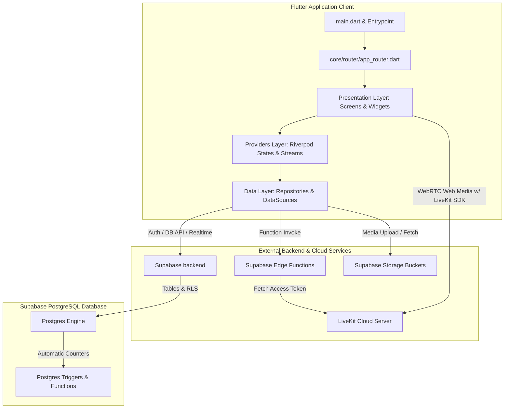
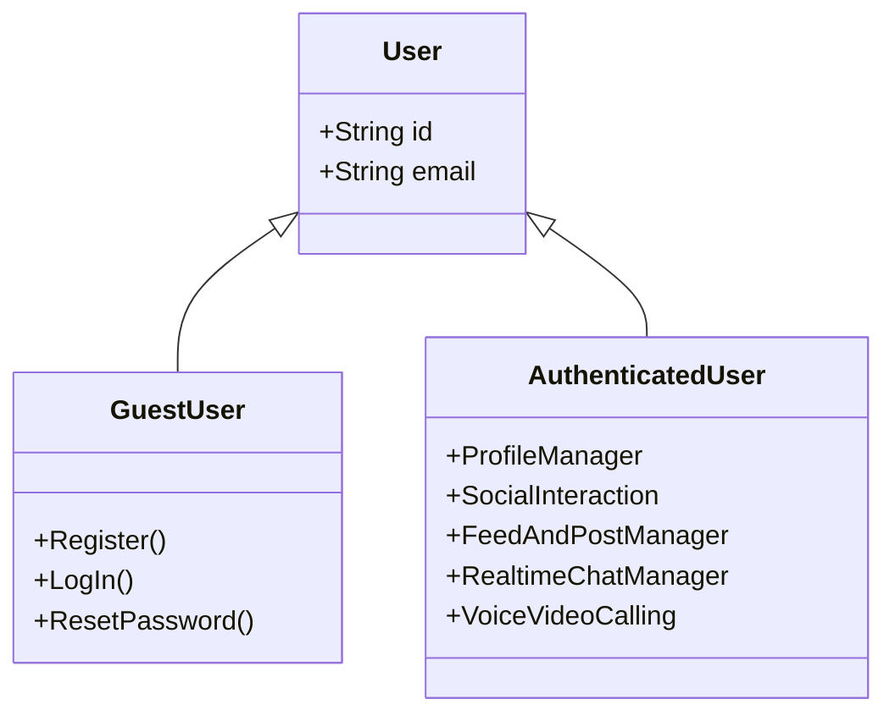
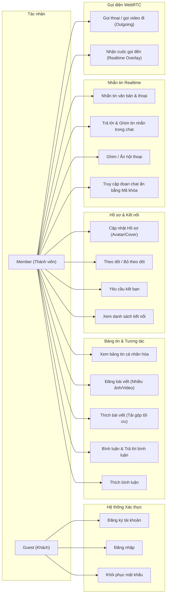

# 🏛️ Kiến trúc dự án, Tác nhân & Use Cases — MiniSocial

Tài liệu này phân tích chi tiết cấu trúc hệ thống, mô hình dữ liệu, phân quyền người dùng và danh sách các Use Cases của ứng dụng **MiniSocial** (Flutter + Supabase + LiveKit).

---

## 1. Kiến trúc Hệ thống (Project Architecture)

MiniSocial áp dụng mô hình kiến trúc **Feature-First** (Tổ chức thư mục theo tính năng) kết hợp với mô hình phân lớp **Layered Architecture (Clean/Domain-Driven Design)** ở cấp độ feature. Cách tiếp cận này giúp cô lập logic nghiệp vụ, quản lý trạng thái hiệu quả và dễ dàng mở rộng.

### 1.1 Sơ đồ Kiến trúc Tổng quan (Mermaid Diagram)

### 1.2 Phân tích các lớp Kiến trúc trong `lib/`

1. **Lớp Core (`lib/core/`)**:
   - Chứa các định nghĩa toàn cục: Palette màu sắc (`app_colors.dart`), kiểu chữ (`app_text_styles.dart`), cấu hình định tuyến (`app_router.dart` sử dụng GoRouter).
   - Theme sáng/tối của ứng dụng phong cách iOS/Material.
   - Các tiện ích mở rộng hệ thống (`extensions/`).

2. **Lớp Shared (`lib/shared/`)**:
   - Chứa các UI components dùng chung trên toàn app (avatar tối ưu hoá bộ nhớ `app_avatar.dart`, custom button, custom text field).
   - Cung cấp provider cốt lõi: `supabaseClientProvider` khởi tạo kết nối Supabase.

3. **Lớp Features (`lib/features/`)**:
   Mỗi tính năng là một module khép kín bao gồm:
   - **`domain/`**: Định nghĩa cấu trúc dữ liệu thuần túy (Models: `PostModel`, `ProfileModel`, `MessageModel`, `CallModel`). Không chứa logic UI hay framework.
   - **`data/`**: Chịu trách nhiệm trực tiếp giao tiếp với Supabase qua repository classes (CRUD, Storage, Edge Functions). Lớp này che giấu chi tiết API đối với các lớp bên trên.
   - **`providers/`**: Sử dụng Riverpod (`FutureProvider`, `StreamProvider`, `StateProvider`) để quản lý và phân phối trạng thái cho UI. Luồng dữ liệu tự động cập nhật phản ứng (Reactive) thông qua Realtime.
   - **`presentation/`**: Chứa toàn bộ giao diện người dùng bao gồm `screens/` (màn hình lớn) và `widgets/` (các thành phần nhỏ hơn).

---

## 2. Các Tác nhân / Người dùng (User Roles & Actors)

Hệ thống MiniSocial phân loại 2 tác nhân chính dựa trên trạng thái xác thực:

### 2.1 Guest User (Khách chưa đăng nhập)
- **Mô tả**: Người dùng tải ứng dụng nhưng chưa đăng nhập hoặc đăng ký tài khoản.
- **Quyền hạn**: Bị giới hạn hoàn toàn ở màn hình Auth Guard. Chỉ được truy cập:
  - Xem màn hình Đăng ký, Đăng nhập, Quên mật khẩu.

### 2.2 Authenticated User (Thành viên đã đăng nhập)
- **Mô tả**: Người dùng có tài khoản hợp lệ và phiên làm việc (Session) đang hoạt động.
- **Quyền hạn**: Toàn quyền tương tác với mọi chức năng mạng xã hội:
  - Quản lý hồ sơ cá nhân và kết nối xã hội.
  - Viết bài viết, bình luận, tương tác thích (like).
  - Trò chuyện thời gian thực, ẩn cuộc trò chuyện (Passcode bảo mật), ghim, reply, gửi ảnh.
  - Thực hiện và nhận các cuộc gọi thoại / video WebRTC.

---

## 3. Các Use Cases của Ứng dụng

Dưới đây là sơ đồ và bảng mô tả Use Case chi tiết phân chia theo các nhóm module tính năng cốt lõi.

### 3.1 Sơ đồ Use Case Tổng quát (Mermaid Flowchart)

---

### 3.2 Đặc tả chi tiết các Use Cases chính

| ID | Nhóm tính năng | Tên Use Case | Tác nhân chính | Luồng hoạt động chính |
| :--- | :--- | :--- | :--- | :--- |
| **UC-01** | **Xác thực** | Đăng ký tài khoản | Guest | Người dùng nhập Email, Password, Họ tên $\rightarrow$ Hệ thống kiểm tra hợp lệ $\rightarrow$ Tạo tài khoản Auth trên Supabase $\rightarrow$ Gửi mail xác nhận $\rightarrow$ Trigger trên Postgres tự động sinh profile mặc định. |
| **UC-02** | **Xác thực** | Đăng nhập | Guest | Người dùng nhập Email + Password $\rightarrow$ Supabase xác thực $\rightarrow$ Lưu Session an toàn bằng SecureStorage $\rightarrow$ Redirect sang Main Shell `/feed`. |
| **UC-03** | **Hồ sơ** | Cập nhật hồ sơ | Member | Người dùng chọn ảnh từ Gallery $\rightarrow$ Nén ảnh $\rightarrow$ Upload lên Bucket Storage (`avatars` hoặc `covers`) $\rightarrow$ Cập nhật thông tin Full Name, Bio, Username trong DB profiles. |
| **UC-04** | **Hồ sơ** | Xem danh sách kết nối | Member | Người dùng nhấn vào Followers/Following $\rightarrow$ App mở màn hình Cupertino Sliding Tab $\rightarrow$ Hiển thị danh sách người dùng kèm nút tương tác Follow/Unfollow tức thời. |
| **UC-05** | **Bảng tin** | Xem bảng tin | Member | Hệ thống tự động tải gộp (Batch-fetch) bài viết từ những người đang theo dõi và chính mình $\rightarrow$ Tải trước trạng thái Thích của toàn bộ bài viết (triệt tiêu lỗi nhấp nháy UI) $\rightarrow$ Hiển thị dạng PostCard phân trang. |
| **UC-06** | **Bài viết** | Đăng bài viết mới | Member | Người dùng chọn tối đa 5 ảnh hoặc 1 video $\rightarrow$ Nhập Caption $\rightarrow$ Nén media $\rightarrow$ Upload lên Storage `posts/` $\rightarrow$ Lưu thông tin liên kết trong DB `posts` và `post_media`. |
| **UC-07** | **Bình luận** | Bình luận & Thích bình luận | Member | Người dùng mở bình luận $\rightarrow$ Nhập văn bản hoặc phản hồi bình luận gốc $\rightarrow$ Hệ thống cập nhật số đếm bằng trigger tự động $\rightarrow$ Người dùng có thể click Tim thích bình luận (nạp gộp batch-fetching, Optimistic UI). |
| **UC-08** | **Trò chuyện** | Quản lý hội thoại | Member | Người dùng vuốt phải hội thoại để Ghim (toggle ghim đẩy lên đầu danh sách), vuốt trái để Ẩn hoặc Xóa hội thoại vĩnh viễn (giao diện Dialog xác nhận Cupertino mượt mà). |
| **UC-09** | **Trò chuyện** | Truy cập phòng chat ẩn | Member | Người dùng nhấn vào thư mục đoạn chat bị ẩn $\rightarrow$ Hệ thống yêu cầu thiết lập Passcode 6 số (lần đầu) hoặc kiểm tra Passcode đã cài đặt $\rightarrow$ Nhập đúng mã khóa để mở khóa màn hình. |
| **UC-10** | **Trò chuyện** | Nhắn tin nâng cao | Member | Trò chuyện thời gian thực $\rightarrow$ Cho phép trích dẫn tin nhắn (Reply), Ghim tin nhắn lên thanh tiêu đề đầu phòng chat, nhấp tin nhắn ghim để cuộn mượt mà (Jump) đến vị trí ban đầu $\rightarrow$ Hiển thị trạng thái "Đã xem" chi tiết khi đối phương đã mở chat. |
| **UC-11** | **Gọi thoại/Video**| Thực hiện cuộc gọi đi | Member | Nhấn nút gọi đi $\rightarrow$ Tạo bản ghi calls trạng thái `ringing` $\rightarrow$ Lấy LiveKit token bảo mật từ Edge Function $\rightarrow$ Kết nối phòng gọi WebRTC $\rightarrow$ Đổ chuông (dial tone) trong 60 giây $\rightarrow$ Tự động dọn dẹp khi hết giờ (missed) hoặc khi hủy (cancelled). |
| **UC-12** | **Gọi thoại/Video**| Nhận cuộc gọi đến | Member | Hệ thống Realtime tại root widget nhận sự kiện cuộc gọi `ringing` gửi tới ID của mình $\rightarrow$ Phát nhạc chuông (ringtone) và hiện màn hình Incoming Call $\rightarrow$ Cho phép Nhấc máy (Connect LiveKit phòng thoại/video) hoặc Từ chối (declined). |

---

## 4. Cơ chế Đảm bảo UI/UX cao cấp (Aesthetics & UX Mechanisms)

Để mang lại trải nghiệm tuyệt vời và cao cấp cho người dùng, MiniSocial tích hợp các cơ chế tối ưu hóa đặc biệt:

1. **Frosted-Glass Effect (Hiệu ứng kính mờ)**:
   TabBar và Navigation Bar được phủ lớp kính mờ Apple-style bằng cách tận dụng `BackdropFilter` và cơ chế pha trộn màu HSL để tạo cảm giác sang trọng, có chiều sâu khi cuộn nội dung phía dưới.

2. **Optimistic UI Updates (Cập nhật giao diện lạc quan)**:
   Với các thao tác Thích bài viết, Thích bình luận và Theo dõi, giao diện thay đổi trạng thái trái tim/số đếm **ngay lập tức** trước khi yêu cầu mạng được gửi tới Supabase. Nếu yêu cầu mạng bị lỗi, hệ thống tự động hoàn tác (rollback) trạng thái để duy trì tính chính xác mà vẫn tạo cảm giác siêu nhạy (zero latency).

3. **N+1 Query Elimination & Batch-Fetching (Triệt tiêu truy vấn N+1)**:
   Trạng thái thích bài viết và thích bình luận được nạp chung cùng lúc trong một câu truy vấn duy nhất sử dụng filter `.in()` của Supabase. Điều này giúp loại bỏ 100% hiện tượng chớp nhấp nháy UI khi cuộn bảng tin và giảm thiểu tối đa tải của máy chủ.

4. **Passcode & Privacy Protection (Bảo mật quyền riêng tư)**:
   Sử dụng Secure Storage để mã hóa passcode, tự động quản lý trạng thái khóa đoạn chat ẩn, mang đến cảm giác bảo mật tuyệt đối cho người sử dụng.
