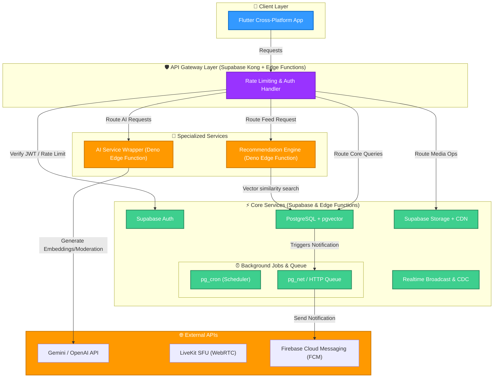

# Kế hoạch Nâng cấp Hệ thống MiniSocial lên Startup-Grade

Kế hoạch này vạch ra lộ trình nâng cấp ứng dụng **MiniSocial** hiện tại từ trạng thái "đồ án tốt nghiệp" thành một sản phẩm startup thực tế, hoạt động ổn định, bảo mật cao và tích hợp trí tuệ nhân tạo (AI). 

Chúng ta sẽ giữ vững nguyên tắc: **mỗi phần hoàn thành đều phải chạy được, có cấu trúc rõ ràng (Clean Architecture), có test tự động và tài liệu đầy đủ.**

---

## 🏛️ Kiến trúc và Thiết kế Hệ thống (Startup Architecture Design)

Để đảm bảo hệ thống có khả năng mở rộng (scalable) và bảo trì (maintainable), chúng ta sẽ chuyển đổi kiến trúc sang mô hình phân rã dịch vụ như sau:



### 1. API Gateway (Supabase Kong & Edge Functions)
* **Xác thực (Authentication)**: Supabase Auth kết hợp mã hóa JWT.
* **Giới hạn tốc độ (Rate Limiting)**: Sử dụng các Edge Functions làm middleware để lưu trữ số lượng request tạm thời trong bộ nhớ đệm (hoặc tích hợp Redis/Upstash) để tránh spam API, bảo vệ cơ sở dữ liệu.

### 2. AI Service Độc lập
* Tách biệt logic tích hợp AI ra một Edge Function riêng (`supabase/functions/ai-service`).
* Interface chung nhận input (Text, Image) và trả về output tiêu chuẩn, giúp hoán đổi dễ dàng giữa **Gemini API** và **OpenAI API** chỉ bằng cách đổi cấu hình biến môi trường (`ENV`), không ảnh hưởng tới code Flutter.

### 3. Recommendation Engine Độc lập
* Tách riêng logic đề xuất nội dung bảng tin và gợi ý bạn bè ra Edge Function (`supabase/functions/recommendation-engine`).
* Tính toán feed bằng thuật toán kết hợp:
  * **Content-based**: Dựa trên sở thích người dùng (`interests`).
  * **Semantic (pgvector)**: Tính khoảng cách cosine giữa vector sở thích của user và vector bài viết để kéo các bài viết liên quan.
  * **Collaborative**: Gợi ý bài viết có tương tác cao (Like/Comment) từ những người dùng có cùng danh sách bạn bè/following.

### 4. Background Jobs & Queue
* Sử dụng extension `pg_cron` của PostgreSQL kết hợp `pg_net` để gọi định kỳ các Edge Functions xử lý tác vụ nặng.
* **Tác vụ nền**:
  * Tạo vector embedding cho bài viết mới.
  * Tính toán và dọn dẹp các Tin bài (Stories) hết hạn (sau 24 giờ).
  * Tổng hợp chỉ số tương tác (DAU/MAU, Trending hashtag) mỗi đêm.
  * Gửi email/Push notification hàng loạt qua hàng đợi (Priority Queue).

### 5. Observability (Giám sát)
* **Log Centralization**: Đẩy log từ Flutter (qua Firebase Crashlytics/Sentry) và Edge Functions (qua Supabase Logflare) về một mối.
* **Audit Trail**: Tạo bảng `audit_logs` trong Postgres để ghi lại toàn bộ hành động nhạy cảm (Đăng nhập thiết bị mới, Thay đổi mật khẩu, Admin thực hiện xóa bài/ban user).

---

## 📅 Lộ trình phát triển 15 Sprint Chi tiết

### Sprint 0 — Foundation (Tuần 1)
* **Mục tiêu**: Thiết lập nền móng kiến trúc Clean Architecture cho Flutter, thiết lập môi trường Local Development với Supabase CLI và quy chuẩn hóa Git.
* **Công việc cụ thể**:
  1. Tổ chức cấu trúc thư mục Flutter theo Clean Architecture:
     ```
     lib/
     ├── core/             # Services (ObjectBox, Connection), Theme, Router, Errors
     ├── shared/           # Widgets, Models dùng chung
     └── features/
         └── [feature]/
             ├── data/         # Datasources (Supabase API), Repositories Impl
             ├── domain/       # Entities (Models), Repositories Interfaces, UseCases
             └── presentation/ # Screens, Widgets, Riverpod Providers
     ```
  2. Setup Supabase CLI locally. Khởi tạo thư mục `supabase` trong dự án để quản lý Database Migrations dưới dạng code (Git versioned).
  3. Cài đặt đa môi trường: `.env.development`, `.env.staging`, `.env.production`.
  4. Viết Core Logging (`Logger` trong Dart) và cơ chế bắt lỗi tập trung (`GlobalErrorHandler`).
* **Test**: Viết Unit Test đầu tiên cho `GlobalErrorHandler` và `ConnectivityService`.

### Sprint 1 — Authentication
* **Mục tiêu**: Luồng đăng ký, đăng nhập an toàn, quản lý phiên và quản lý thiết bị.
* **Công việc cụ thể**:
  1. Backend: Cấu hình Supabase Auth, viết trigger tự tạo `profiles` khi đăng ký mới (đã có trong schema, cần import vào migration file).
  2. Mobile: Viết `AuthRepository` giao diện và triển khai thực tế. Tích hợp Google Sign-In & Apple Sign-In.
  3. Quản lý thiết bị: Tạo bảng `user_sessions` để theo dõi danh sách thiết bị đang đăng nhập, cho phép người dùng đăng xuất từ xa.
* **Test**: Unit test cho `AuthRepository` (mock Supabase client).

### Sprint 2 — User Profile & Privacy
* **Mục tiêu**: Hoàn thiện thông tin cá nhân và thiết lập quyền riêng tư.
* **Công việc cụ thể**:
  1. Thêm trường `interests` (dạng mảng text/id) và thiết lập quyền riêng tư vào bảng `profiles`.
  2. Xây dựng UI chỉnh sửa trang cá nhân nâng cao (Bio, Avatar, Cover, chọn Sở thích từ danh sách).
  3. Triển khai chức năng Block/Mute người dùng khác (Bảng `blocks`, sửa RLS posts/messages để không hiển thị nội dung của người bị block).
* **Test**: Integration test cho luồng cập nhật thông tin cá nhân và tải ảnh đại diện lên Storage.

### Sprint 3 — Social Core (Posts, Comments, Mentions)
* **Mục tiêu**: Đăng bài viết kèm hashtag, đề cập người dùng (@mention) và tương tác.
* **Công việc cụ thể**:
  1. Thiết kế parser Regex trong Flutter và Postgres để trích xuất `#hashtag` và `@username` từ caption bài viết.
  2. Viết trigger PostgreSQL để tăng/giảm `likes_count` và `comments_count` (tối ưu hóa tốc độ đọc feed).
  3. Triển khai phân trang feed bài viết (Infinite Scroll) với cơ chế Optimistic UI cho nút Like.
* **Test**: Unit test cho bộ parser hashtag/mention. Integration test cho luồng comment lồng nhau (Replies).

### Sprint 4 — Chat Realtime & Vanish Mode
* **Mục tiêu**: Nhắn tin tức thời, seen receipts, tin nhắn tự hủy (Vanish mode) và ghi âm giọng nói.
* **Công việc cụ thể**:
  1. Đồng bộ tin nhắn qua Supabase Realtime (CDC). Cập nhật `is_seen` và `seen_at` tức thời.
  2. Tích hợp tính năng tự hủy tin nhắn: Client tự xóa sau X giây hiển thị, đồng thời chạy background cron-job trên Postgres để quét và xóa vĩnh viễn trên DB.
  3. Gửi tin nhắn thoại: Ghi âm bằng thư viện `record`, nén âm thanh, tải lên bucket `messages`.
* **Test**: Test kiểm thử độ trễ tin nhắn realtime và kiểm tra việc tự động xóa tin nhắn hết hạn.

### Sprint 5 — Media Optimization & CDN
* **Mục tiêu**: Xử lý tải lên media nhanh chóng, tiết kiệm băng thông và tăng trải nghiệm tải.
* **Công việc cụ thể**:
  1. Client-side: Tự động nén ảnh chất lượng cao sử dụng `flutter_image_compress` trước khi upload.
  2. Cấu hình Supabase Storage với chính sách Cache-Control dài hạn (vd: `max-age=31536000`).
  3. Video Post: Cấu hình phát video tối ưu hóa, tự động tạm dừng khi cuộn qua (lazy load controller).
* **Test**: So sánh dung lượng file trước/sau khi nén và tốc độ tải ảnh từ CDN.

### Sprint 6 — AI Core (Dịch vụ AI nâng cao)
* **Mục tiêu**: Tích hợp các tính năng AI hỗ trợ người dùng và kiểm duyệt nội dung tự động.
* **Công việc cụ thể**:
  1. Xây dựng dịch vụ `ai-service` trên Edge Functions giao tiếp với Gemini/OpenAI.
  2. **AI Caption**: Gợi ý caption hài hước/sâu sắc dựa trên ảnh tải lên (Gemini Vision API).
  3. **AI Translate**: Cho phép nhấn giữ bài viết/bình luận để dịch sang ngôn ngữ của thiết bị.
  4. **AI Moderation**: Tự động chặn các bài đăng chứa hình ảnh nhạy cảm hoặc từ ngữ thù ghét ngay từ bước tạo (gọi kiểm duyệt trước khi lưu bài viết).
* **Test**: Viết test giả lập dữ liệu độc hại để xác thực hệ thống AI Moderation hoạt động đúng.

### Sprint 7 — Recommendation System (Đề xuất)
* **Mục tiêu**: Xây dựng thuật toán xếp hạng Feed và gợi ý người quen.
* **Công việc cụ thể**:
  1. Viết Edge Function `recommendation-engine` tính toán danh sách bài đăng phù hợp cho từng user.
  2. Triển khai thuật toán "Những người bạn có thể biết" (đếm số bạn chung trong bảng `friend_requests` trạng thái `accepted` và trùng `interests`).
  3. Lưu vết lịch sử tương tác ẩn (implicit feedback - xem bài viết lâu, click ảnh) phục vụ xếp hạng feed.
* **Test**: Đánh giá độ chính xác của đề xuất bạn bè và thời gian phản hồi của API Feed đề xuất.

### Sprint 8 — AI Search (Semantic & Hybrid Search)
* **Mục tiêu**: Tìm kiếm thông minh bằng ý nghĩa ngữ nghĩa (Semantic Search).
* **Công việc cụ thể**:
  1. Kích hoạt extension `pgvector` trên Database Supabase.
  2. Tạo Edge Function tự động sinh vector embedding (384/1536 dims) của bài viết khi được tạo và lưu vào cột `embedding` trong bảng `posts`.
  3. Viết Database Function thực hiện Hybrid Search: Kết hợp Full-text Search (chính xác từ khóa) và Cosine Similarity (chính xác ngữ nghĩa) bằng thuật toán Reciprocal Rank Fusion (RRF).
* **Test**: Đo lường sự khác biệt về kết quả tìm kiếm giữa tìm kiếm thường và Hybrid Search.

### Sprint 9 — Notification System (Push Notifications & Queue)
* **Mục tiêu**: Gửi thông báo đẩy tức thời và an toàn thông qua FCM.
* **Công việc cụ thể**:
  1. Đăng ký device token của người dùng trên Firebase Cloud Messaging.
  2. Thiết lập bảng `notification_queue` làm hàng đợi gửi thông báo nền.
  3. Viết background worker (Postgres Trigger -> pg_net -> FCM API) để gửi thông báo đẩy mà không làm chậm giao dịch DB chính.
* **Test**: Đảm bảo thông báo hiển thị đúng khi ứng dụng ở chế độ background/terminated.

### Sprint 10 — Admin Dashboard & Moderation
* **Mục tiêu**: Giao diện quản lý báo cáo nội dung và xử lý vi phạm.
* **Công việc cụ thể**:
  1. Xây dựng giao diện Web cho Admin duyệt hàng đợi báo cáo (Report Queue).
  2. Tích hợp AI hỗ trợ admin: Phân tích lý do người dùng báo cáo và đưa ra gợi ý (ví dụ: "Có khả năng 90% vi phạm điều khoản").
  3. Chức năng Ban User và Khóa bài đăng trực tiếp kèm gửi email thông báo lý do.
* **Test**: Test luồng báo cáo bài viết -> bài viết xuất hiện trên dashboard admin -> admin duyệt xóa.

### Sprint 11 — Analytics & Metrics
* **Mục tiêu**: Thu thập số liệu vận hành phục vụ tối ưu hóa sản phẩm.
* **Công việc cụ thể**:
  1. Ghi nhận dữ liệu sử dụng: Đăng nhập hàng ngày (DAU), hàng tháng (MAU), số bài viết được tạo.
  2. Theo dõi thời gian xem bài viết để tối ưu hóa thuật toán đề xuất ở Sprint 7.
  3. Trực quan hóa số liệu trên trang quản trị Admin Dashboard (biểu đồ tăng trưởng).
* **Test**: Viết test giả lập hành động của 100 người dùng ảo để kiểm tra tính chính xác của dữ liệu thống kê.

### Sprint 12 — Security & Audit Logs
* **Mục tiêu**: Chống tấn công XSS, SQL Injection và ghi nhận lịch sử hệ thống.
* **Công việc cụ thể**:
  1. Sanitization: Lọc toàn bộ input text trên cả Client và Server để loại bỏ mã độc HTML/JS.
  2. Cấu hình CORS chặt chẽ cho Supabase Edge Functions (chỉ cho phép domain web app của bạn và ứng dụng di động).
  3. Hoàn thiện bảng `audit_logs` lưu thông tin các tác vụ quản trị và bảo mật.
* **Test**: Chạy thử các câu lệnh tấn công XSS/SQL Injection phổ biến để đảm bảo hệ thống chặn thành công.

### Sprint 13 — Performance Optimization
* **Mục tiêu**: Tối ưu tốc độ tải và tiết kiệm dung lượng thiết bị.
* **Công việc cụ thể**:
  1. Postgres: Thiết lập index thích hợp (B-Tree trên khóa ngoại, GIN trên text search, HNSW trên cột vector).
  2. Flutter: Tối ưu bộ nhớ đệm (caching) với ObjectBox cho dữ liệu offline.
  3. Lazy loading hình ảnh/video khi người dùng cuộn nhanh.
* **Test**: Đo thời gian tải màn hình Feed dưới môi trường mạng yếu (3G giả lập).

### Sprint 14 — Production Deployment & CI/CD
* **Mục tiêu**: Đưa sản phẩm lên môi trường thực tế tự động.
* **Công việc cụ thể**:
  1. Viết GitHub Actions CI/CD để tự động:
     * Chạy linter và test suite của Flutter.
     * Deploy Supabase migrations và Edge Functions lên Supabase Production Cloud.
     * Build và deploy Flutter Web lên Vercel.
  2. Cấu hình Sentry giám sát lỗi thời gian thực.
  3. Thiết lập sao lưu tự động cơ sở dữ liệu định kỳ hàng ngày.
* **Test**: Thực hiện thử nghiệm đẩy code lên nhánh `main` để kích hoạt toàn bộ luồng CI/CD.

---

## 🙋‍♂️ Câu hỏi làm rõ dành cho Người dùng (Open Questions)

> [!IMPORTANT]
> Vui lòng phản hồi các câu hỏi dưới đây để chúng tôi điều chỉnh kế hoạch trước khi bắt tay vào triển khai Sprint 0:

1. **LLM Provider mặc định**: Bạn muốn chọn **Gemini API (Google)** hay **OpenAI API** làm cấu hình mặc định ban đầu cho AI Service? (Gemini có chi phí rẻ hơn và dễ dùng hơn tại Việt Nam, OpenAI có hiệu năng văn bản nhỉnh hơn).
2. **Recommendation Engine**: Bạn muốn viết thuật toán đề xuất trực tiếp bằng SQL/TypeScript chạy trên Supabase Edge Functions (nhẹ nhàng, dễ deploy trực tiếp) hay muốn dựng một dịch vụ Python riêng biệt (ví dụ FastAPI + Pandas) chuyên cho phân tích dữ liệu? (Khuyên dùng chạy trực tiếp trên Edge Functions để đồng bộ Supabase tốt hơn trong giai đoạn đầu).
3. **Cách thức Kiểm thử (Testing Framework)**: Bạn muốn tập trung viết Unit Test cho tầng Domain/Logic trong Flutter trước hay muốn viết Integration Test trực tiếp cho các luồng UI quan trọng (Login, Post, Chat)?
4. **Môi trường Server LiveKit**: Bạn đã có sẵn LiveKit Cloud Server hay muốn chúng tôi thiết lập hướng dẫn tự host LiveKit Server trên VPS cá nhân của bạn trong các sprint sau?

---

## 🔬 Kế hoạch Xác thực (Verification Plan)

### Kiểm thử Tự động (Automated Tests)
* Chạy bộ kiểm thử Flutter để đảm bảo code sạch lỗi cú pháp và hoạt động đúng logic:
  ```powershell
  flutter test
  ```
* Phân tích mã nguồn tĩnh chống lỗi lặt vặt:
  ```powershell
  flutter analyze
  ```

### Kiểm thử Thủ công (Manual Verification)
* Chạy ứng dụng giả lập (Emulator/Simulator) trên thiết bị di động để kiểm tra trải nghiệm vuốt chạm thực tế và độ phản hồi của UI đối với các tính năng Realtime Chat/Vanish Mode.
* Kiểm tra việc triển khai Edge Functions trên bảng điều khiển Supabase Dashboard.
